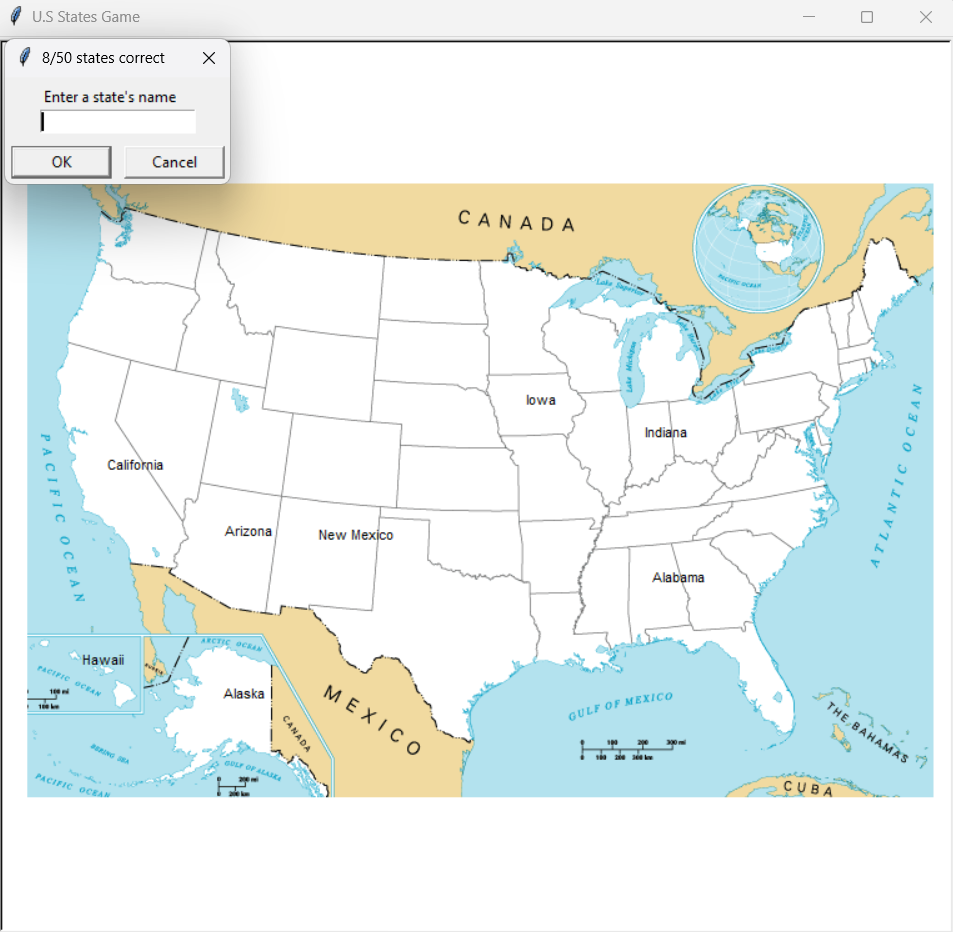

# Day 25 - U.S. States Game 🇺🇸🐢

## 📌 Project

An interactive U.S. States guessing game built using **Python**, **Turtle graphics**, **CSV data**, and the **Pandas library**.

The player tries to guess all 50 U.S. states. Correct guesses are displayed on their corresponding locations on the map. If the player exits the game, the program creates a CSV file containing the states that still need to be learned.

## 📸 Gameplay



## 🧠 What I Learned

- Reading CSV data using Python
- Working with the **Pandas library**
- Creating and working with Pandas DataFrames
- Working with rows and columns
- Converting DataFrame columns into Python lists
- Filtering DataFrames based on a condition
- Accessing values from a DataFrame
- Using `.to_list()`
- Using `.item()` to retrieve individual values
- Creating new DataFrames
- Writing DataFrames to CSV files using `.to_csv()`
- Using CSV files as a source of structured data
- Combining Pandas with Turtle graphics
- Using a background image with Turtle
- Creating and positioning Turtle objects
- Handling user input with `screen.textinput()`
- Using loops and conditional statements
- Tracking guessed states using a list

## 🎮 Game Features

- 🇺🇸 U.S. map with all 50 states
- ⌨️ State name input
- ✅ Correct guesses are displayed on the map
- 📊 Progress tracker showing states guessed out of 50
- 🐢 Turtle graphics for displaying state names
- 📄 Reads state coordinates from a CSV file
- 💾 Creates a `states_to_learn.csv` file when the player exits
- 📚 Keeps track of states that have not yet been guessed

## 🎯 What I Practiced

This project introduced me to working with real-world structured data using the **Pandas library**.

I practiced reading CSV files, working with DataFrames and columns, filtering data, extracting values, creating new DataFrames, and saving data back to CSV files.

I also learned how to combine Pandas with Turtle graphics to create an interactive data-driven game.

## 📂 Project Structure

```text
Day - 25 - U.S. States Game/
│
├── main.py
├── 50_states.csv
├── blank_states_img.gif
├── states_to_learn.csv
└── README.md
